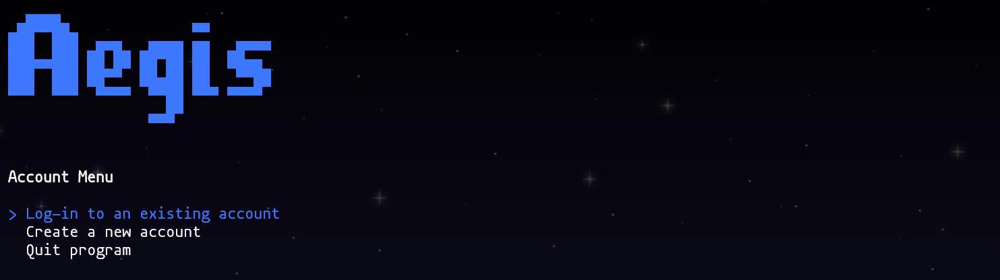
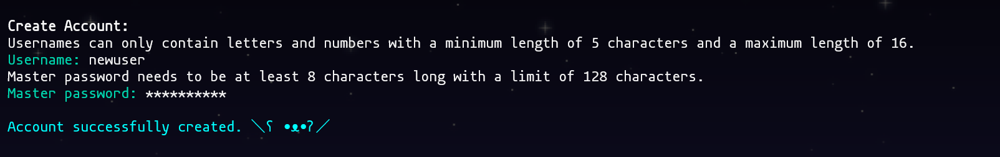
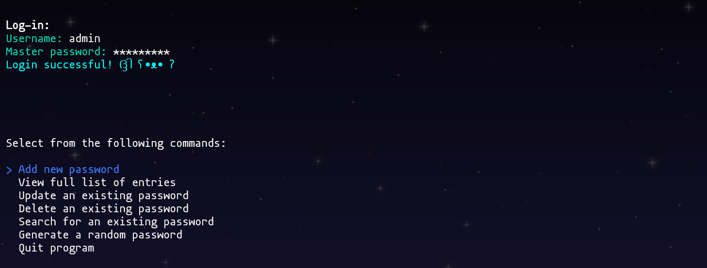
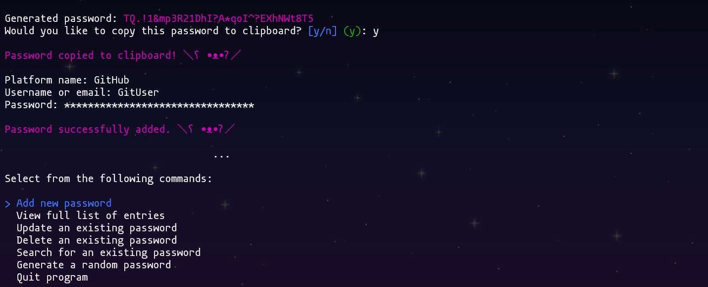
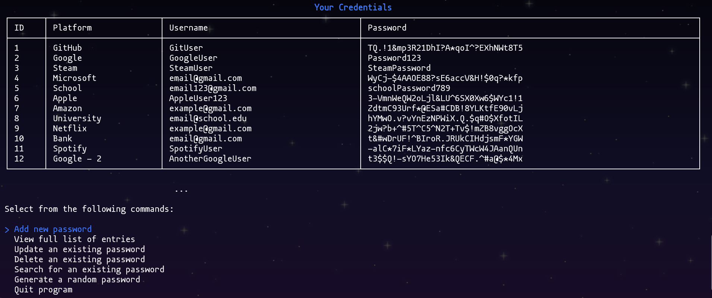
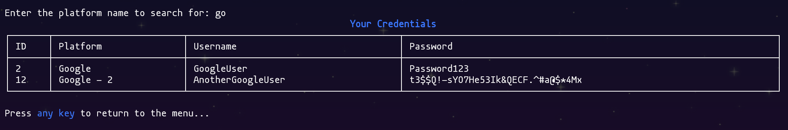
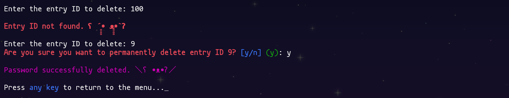

<p align="center">
  
</p>

<h1 align="center">Aegis</h1>

<div align="center">
  <a href="https://github.com/0111000001101001/Aegis/issues">Issues</a>
  <span>&nbsp;&nbsp;•&nbsp;&nbsp;</span>
  <a href="https://github.com/0111000001101001/Aegis/tree/master/docs">Documentation (Webpage Soon)</a>
  </br>
</div>

---

Aegis is a local and CLI-based password manager built with C# and SQLite. It provides a simple and clean interface
for managing your sensitive credentials directly through your terminal.

## 🛡️ Description

In a world where people are required to sign up for dozens of websites and services, Aegis offers a simple solution
for password management. It makes use of cryptographic concepts to protect your data locally. All your credentials
and information are stored in your personal vault (`{your_username}.db`) in the project's `data` directory, encrypted 
with a key derived from your master password. Although Aegis supports multiple users, you are the only one who can 
access your vault.

## ✨ Features

- **User Accounts**: Create a personal vault protected by a master password.

- **Cryptography**:
    - **Hashing**: Master passwords are not stored. They are hashed using **PBKDF2 (RFC 2898)** with **SHA-256**,
    a high iteration count, and a unique salt for each user to prevent rainbow table and brute-force attacks.
    - **Encryption**: All stored credentials are encrypted using **AES-256**, a symmetric encryption standard.
    - **Secure Key Management**: The encryption key is derived from your master password and salt for the duration
    of your session and is never stored on disk.

- **Full Credential Management**:
    - Add new credentials (platform name, username, password).
    - View a full list of your stored credentials in a clean, table-based layout.
    - Update existing passwords.
    - Delete credentials you no longer need.
    - Search for specific credentials by platform name.
    - Generate a random 32-byte password.

- **User-Friendly CLI**: A simple command-line interface implemented with the `Spectre.Console` library.

- **Local**: Your encrypted vault is stored entirely on your local machine. No cloud, no servers, no third-party access.

## 📋 Requirements

To build and run Aegis, you will need the following:
- [.NET 10 SDK](https://dotnet.microsoft.com/en-us/download/dotnet/10.0)

## 🚀 Getting Started

Follow these steps to get Aegis set up on your local machine.

### 1. Clone the Repository
```bash  
git clone https://github.com/0111000001101001/Aegis.git

cd Aegis
```

### 2. Run the Application

Use the .NET CLI to run the project. The required NuGet packages will be restored automatically.
```bash
dotnet run --project src/Aegis
```

On the first launch, Aegis will automatically create the `aegis.db` SQLite database file in the project's `data` 
directory located in the root of the solution. You will then be prompted to create a new account or log in. 
For new accounts, an individual vault, named after the username, will be created in the `data` directory as well.

## 💻 Usage

The application can be navigated using the `Up` and `Down` keys to go through different options. The `Enter` key
is used to select an option. When prompted to confirm a certain action, enter `y` for `yes` or `n` for `no`.

## 📦 Dependencies

Aegis relies on a few libraries:

- **[CSharpier.Core](https://www.nuget.org/packages/CSharpier.Core)**: A C# code formatter, used to maintain consistent code style across the project. May be used alongside the "CSharpier" extension.
- **[Microsoft.Data.Sqlite](https://www.nuget.org/packages/Microsoft.Data.Sqlite)**: A lightweight ADO.NET provider for SQLite, used for all database operations.
- **[Spectre.Console](https://www.nuget.org/packages/Spectre.Console)**: A .NET library for creating beautiful and interactive console applications.
- **[System.Security.Cryptography.ProtectedData](https://www.nuget.org/packages/System.Security.Cryptography.ProtectedData)**: Provides access to the Windows Data Protection API (DPAPI) for secure data encryption and decryption.
- **[TextCopy](https://www.nuget.org/packages/TextCopy)**: Provides cross-platform support for copying text to the system clipboard.
 
## ♾️ DevOps Tools
- **[Doxygen](https://www.doxygen.nl)**: A documentation generator, used to create code documentation from comments.
- **[PlantUML](https://plantuml.com)**: A tool for creating UML diagrams, used in along with Doxygen for visual documentation.
- **[PlantUmlClassDiagramGenerator](https://github.com/pierre3/PlantUmlClassDiagramGenerator)**: A tool to automatically generate PlantUML class diagrams from C# code.
- **[pre-commit](https://pre-commit.com)**: A framework for managing pre-commit hooks, used here to check code styling and quality.

## 📖 Documentation

Documentation can be found in the `docs` directory. For the Doxygen webpage, open the `index.html` file (located in `docs/html`) with a web browser. 
For the UML diagram, see `include.png` located in `docs/uml`: [Application UML Diagram](https://github.com/0111000001101001/Aegis/blob/master/docs/uml/include.png)

## ⚠️ Note

This project was created for personal education purposes only. I developed it as a passion project while in college, and I am by no means a security expert. (︶︹︶)

You should probably **not** use this for anything important.

## 👀 Preview








